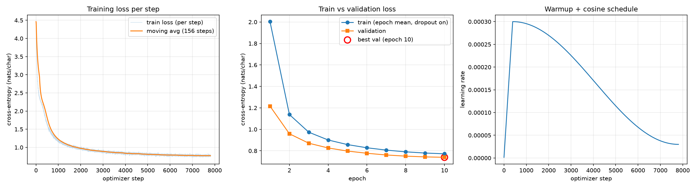

# Task 1: Character-Level GPT on TinyStories (Parth)

Every number here is copied from a run artifact, and each table names its source file.

Reported run: `parth_gpt_char_v1_20260925T214701Z`

| Artifact | Path |
|---|---|
| Final notebook | `task1_llm/parth/src/task1.ipynb` |
| Raw training log | `reproducibility/raw_logs/task1_parth_parth_gpt_char_v1_20260925T214701Z.log` |
| Training manifest (config, environment, split, checkpoint map) | `reproducibility/manifests/task1_parth_parth_gpt_char_v1_20260925T214701Z.json` |
| pip freeze | `reproducibility/manifests/task1_parth_parth_gpt_char_v1_20260925T214701Z_pip_freeze.txt` |
| Evaluation manifest | `reproducibility/manifests/task1_parth_parth_gpt_char_v1_20260925T214701Z_eval_20260925T214954Z.json` |
| Training summary / per-step history | `task1_llm/parth/logs/train_summary_parth_gpt_char_v1_20260925T214701Z.json`, `task1_llm/parth/logs/history_parth_gpt_char_v1_20260925T214701Z.json` |
| Metrics | `task1_llm/parth/metrics_report.csv`, `task1_llm/parth/outputs/eval_results.json` |
| Loss curves | `task1_llm/parth/figures/task1_loss_curve.png` |
| Generated samples | `task1_llm/parth/outputs/generated_samples.txt` (+ `.jsonl`) |
| Failure analysis | `task1_llm/parth/failure_analysis.md` |

## 1. Data and split

Source: `src/dataset.py`, `src/tokenizer.py`, `config/train.yaml`, and the `data_split` block of the training manifest.

| Item | Value |
|---|---|
| Dataset file | `task1_llm/data/TinyStoriesV2-GPT4-train.txt` (not committed) |
| Stories loaded | 80,000 (first `max_stories_to_load` stories in file order) |
| Shuffle / split seed | 8503 |
| Split level | Whole stories; validation stories are taken first, then training stories, so no story appears in both splits |
| Split unit | `sequences` (fixed-length windows) |
| Training windows | 100,000 (from 15,880 stories, 12,800,004 characters) |
| Validation windows | 10,000 (from 1,610 stories, 1,280,350 characters) |
| Window length / stride | 128 / 128 (non-overlapping) |
| Input / target | `x = ids[i : i+128]`, `y = ids[i+1 : i+129]` (target is the input shifted left by one character) |
| Story separator | `"\n\n"` |
| Tokenization | Character level. `CharTokenizer` builds its own `char_to_idx` / `idx_to_char` from the **training split only**, sorted by code point; id 0 is reserved for unknown characters (U+FFFD) |
| Vocabulary size | 81 (80 characters + unknown) |
| Unknown characters in validation text | 0 |

**Split unit.** The handout gives the split sizes (100K / 10K) without a unit. This run counts fixed-length sequences (`split_unit: sequences`): 100,000 training and 10,000 validation windows of 128 characters, since one window is one input-target training example. `split_unit` only decides what `train_size` and `val_size` count; it does not change how stories are separated.

**Why whole stories are split before windows are cut.** `split_stories` shuffles the loaded stories with the seed, assigns whole stories to validation first, and then assigns the following stories to training, until each side has enough characters for its window count. Only after that are the two text streams tokenized and cut into windows, so every story's characters land in exactly one split and no window can contain text from both. If windows from one story appeared on both sides, the validation loss would partly measure recall of names and phrases already seen in training and would overstate how well the model handles unseen stories.

**Split procedure.** The handout asks each member to create their own split; this one is produced from the raw TinyStories file by the project's `split_stories` function and a `CharTokenizer` fit on the training text only. It is deterministic: the first 80,000 stories in file order are shuffled with `random.Random(8503)`, so the same file and seed always give the same split. The reported split uses 1,610 validation stories (1,280,350 characters) and 15,880 training stories (12,800,004 characters); the other 62,510 loaded stories are not used.

## 2. Architecture

Source: `src/model.py`, `config/model.yaml`, and the `model_config` block of the manifest.

Decoder-only GPT, pre-norm, built from basic tensor operations. No `torch.nn.Transformer*`, `nn.MultiheadAttention`, `F.scaled_dot_product_attention`, pretrained tokenizer, or pretrained weights are used (checked by `tests/test_task1_attention.py`).

```
idx (B, T)
 -> token_embedding  nn.Embedding(81, 256)          learned
  + position_embedding nn.Embedding(128, 256)       learned
 -> Dropout(0.1)
 -> 4 x TransformerBlock:
      x = x + MultiHeadSelfAttention(LayerNorm(x))
      x = x + FeedForward(LayerNorm(x))
 -> LayerNorm
 -> lm_head Linear(256, 81, bias=False)             logits over the vocabulary
```

| Component | Implementation |
|---|---|
| Multi-head self-attention | Fused `Linear(256, 768)` for Q, K, V; heads split to (B, 8, T, 32); `softmax(Q K^T / sqrt(32))` computed with `torch.matmul`; softmax in float32; attention dropout 0.1; heads merged and projected with `Linear(256, 256)` + dropout 0.1 |
| Causal mask | Lower-triangular boolean buffer `torch.tril(ones(128, 128))`; blocked scores set to `-inf` before softmax, so weights on future positions are exactly 0 |
| Feed-forward network | `Linear(256, 1024) -> GELU -> Linear(1024, 256) -> Dropout(0.1)` |
| Normalization | Pre-norm `LayerNorm` before attention and FFN in every block, plus a final `LayerNorm` before the LM head |
| Residual connections | Around attention and around the FFN in every block |
| Weight tying | Off (`tie_weights: false`) |
| Initialization | Normal(0, 0.02) for linear and embedding weights, zero biases; attention output and FFN second-layer weights use std `0.02 / sqrt(2 * n_layers)` |

| Hyperparameter | Value |
|---|---|
| `d_model` | 256 |
| `n_heads` / head dim | 8 / 32 |
| `n_layers` | 4 |
| `context_length` | 128 |
| FFN hidden size | 1024 (`ffn_hidden_multiplier: 4`) |
| Dropout | 0.1 |
| Bias in linear layers | Yes (LM head has no bias) |
| Parameter count | **3,233,792** |

Parameter count breakdown (derived from the layer shapes above; matches the logged total):

| Part | Parameters |
|---|---|
| Token embedding (81 x 256) | 20,736 |
| Position embedding (128 x 256) | 32,768 |
| 4 blocks x 789,760 (2 LayerNorms 1,024; QKV 197,376; attn out 65,792; FFN 263,168 + 262,400) | 3,159,040 |
| Final LayerNorm | 512 |
| LM head (256 x 81) | 20,736 |
| **Total** | **3,233,792** |

### Design choices

**Character-level modelling.** The vocabulary is 81 symbols (80 characters seen in the training text plus an unknown id), so the token embedding and the LM head together hold only 41,472 of the 3,233,792 parameters. No word can be out of vocabulary, because any word is spelled from known characters; the validation text contained 0 unknown characters. The cost is sequence length: the generated text averages about 4.6 characters per word including the space, so a 128-character window holds roughly 28 words, and spelling, word boundaries and sentence structure all have to be learned from single characters.

**Hand-written causal self-attention** (`scaled_dot_product_attention` and `MultiHeadSelfAttention` in `src/model.py`):

- One fused `Linear(256, 768)` produces a query, key and value vector for every position. The result is split into Q, K and V and reshaped to (B, 8, T, 32), one slice per head.
- Scores are `Q K^T / sqrt(32)`, computed with `torch.matmul`; entry (t, s) measures how well query t matches key s. Dividing by the square root of the head dimension keeps the variance of the scores near 1, so the softmax does not saturate into near one-hot weights.
- The causal mask is a lower-triangular boolean matrix (`torch.tril`). Scores where key s comes after query t are set to `-inf`, so their weights after the softmax are exactly 0. Without the mask, position t could read the character it is being trained to predict, the training loss would be trivially low, and the model would fail at generation, where future characters do not exist yet.
- The softmax turns each row of scores into weights that sum to 1, and each position's output is the weighted sum of the value vectors of the positions it is allowed to see.
- The softmax is computed in float32 (`torch.softmax(scores.float(), dim=-1)`) and cast back, even under bf16 autocast. Exponentiation is where low-precision attention first overflows or loses precision, and running this one step in float32 is cheap.

**Multi-head attention.** The 256-dimensional vector is split into 8 heads of 32 dimensions, each with its own slice of Q, K and V and its own attention pattern, so different heads can attend to different earlier positions at the same time. The heads are concatenated back to 256 dimensions and mixed by `out_proj`, so 8 heads use the same projection parameters as a single 256-dimensional head.

**Pre-norm.** Each block computes `x = x + attn(ln1(x))` and then `x = x + ffn(ln2(x))`: LayerNorm normalizes the input of each sublayer, while the residual stream itself is never normalized. That leaves a direct identity path from the embeddings to the final LayerNorm, which keeps gradients well scaled through the stack and is generally more stable early in training than post-norm. This run had zero non-finite steps and zero loss spikes; no post-norm model was trained for comparison.

**Learned positional embeddings.** Attention on its own compares positions only by content: without the mask it is permutation-equivariant, and with the causal mask it knows which positions are earlier but not how far back they are. A learned 128 x 256 position table added to the token embeddings gives every position its own vector, which is simple for a fixed maximum length of 128 and costs 32,768 parameters. Sinusoidal encodings would also have worked; they were not compared.

**GELU.** The FFN uses GELU, x multiplied by the standard normal CDF of x. It is a smooth version of ReLU that keeps a small nonzero gradient for slightly negative inputs, and it is the standard activation in GPT-style models such as GPT-2; ReLU was not compared.

**No weight tying.** The LM head is its own 256 x 81 matrix (`tie_weights: false`). With an 81-symbol vocabulary, tying would save only 20,736 parameters (0.64% of the model), while separate matrices let the input embedding and the output projection learn different representations. The code supports tying, but no tied model was trained.

### Model size

Parameter count by component, computed from the layer shapes (the sum matches the logged count):

| Component | Parameters | Share |
|---|---|---|
| Feed-forward networks (4 x 525,568) | 2,102,272 | 65.0% |
| Attention projections, QKV and output (4 x 263,168) | 1,052,672 | 32.6% |
| Position embedding (128 x 256) | 32,768 | 1.0% |
| Token embedding (81 x 256) | 20,736 | 0.6% |
| LM head (256 x 81) | 20,736 | 0.6% |
| LayerNorms (9 x 512) | 4,608 | 0.1% |
| **Total** | **3,233,792** | |

The FFN is about two thirds of every block because it expands each position from 256 to 1,024 units and back: two 256 x 1,024 matrices (524,288 weights), against attention's 256 x 768 QKV and 256 x 256 output matrices (262,144 weights). The embeddings and LM head are under 3% of the total because the vocabulary has only 81 symbols.

At this size one 10-epoch run took 92 s on the RTX 5090 with 1.24 GB of peak GPU memory, and the model saw 127,959,040 training characters, about 40 per parameter. These dimensions were chosen as a small configuration for the lab, not tuned; no other model size was trained.

## 3. Training configuration

Source: `config/train.yaml`, `src/train.py`, and the resolved config in the raw log.

| Setting | Value |
|---|---|
| Loss | Cross-entropy over all 128 next-character positions (`F.cross_entropy`) |
| Optimizer | AdamW, betas (0.9, 0.95), weight decay 0.01 on 2-D weights only (biases and LayerNorm gains get 0) |
| Peak learning rate | 3.0e-4 |
| Warmup | Linear, 5% of total steps = 390 steps |
| Schedule after warmup | Cosine decay to `min_lr_ratio x peak` = 3.0e-5 |
| Epochs | 10 |
| Batch size | 128 windows (128 x 128 = 16,384 characters per step) |
| Steps per epoch / total | 781 / 7,810 (last partial batch dropped) |
| Gradient clipping | Global L2 norm 1.0 |
| Mixed precision | bf16 autocast, no GradScaler (`amp_dtype: auto` picks bf16 on compute capability >= 8.0) |
| TF32 matmul | Allowed |
| Checkpoint selection | `best.pt` = lowest validation loss; `latest.pt` also stores optimizer, scheduler, and scaler state |
| Seed | 8503 |
| Command | `python task1_llm/parth/src/train.py --config task1_llm/parth/config/train.yaml` (from the manifest) |

Learning rate in the raw log: 1.538e-06 at step 1, 3.000e-04 at step 400, 3.000e-05 at step 7800.

### Purpose of each setting

| Setting | Value | Purpose |
|---|---|---|
| Optimizer | AdamW, betas (0.9, 0.95) | Per-parameter adaptive steps with decoupled weight decay. A beta2 of 0.95 lets the second-moment estimate follow changes in gradient scale faster than the default 0.999, a common setting for Transformer training. |
| Weight decay | 0.01, 2-D weights only | Light regularization of the weight matrices. Biases and LayerNorm gains are excluded because pulling them toward zero does not regularize the model. |
| Peak learning rate | 3e-4 | The largest step size, reached at the end of warmup. |
| Warmup | Linear over 390 steps (5% of 7,810) | Keeps early updates small while the weights are random and Adam's moment estimates are still noisy. The raw log shows 1.538e-06 at step 1 and 3.000e-04 at step 400. |
| Decay | Cosine to 3e-5 (10% of peak) | Lowers the step size smoothly so late training makes smaller, finer updates; 3.000e-05 at step 7,800. |
| Batch size | 128 windows (16,384 characters) | 781 optimizer steps per epoch and 7,810 in total, at 1.24 GB of peak GPU memory. |
| Epochs | 10 | The lab minimum. |
| Dropout | 0.1 | Light regularization on the embeddings, attention weights and residual branches. |
| Gradient clipping | Global L2 norm 1.0 | Caps the size of any single update. The pre-clip norm averaged 0.77 with a maximum of 9.55, and 13.3% of steps were clipped. |
| Mixed precision | bf16 autocast | Less memory and faster matrix multiplies than fp32. bf16 keeps fp32's 8-bit exponent, so unlike fp16 it does not overflow at large values and needs no loss scaling; no GradScaler is used on this GPU. |
| Seed | 8503 | Seeds Python, NumPy and PyTorch, which fixes the story shuffle, the weight initialization and the batch order. |

**Alternatives.** The preserved evidence contains only this configuration, plus a reduced smoke run (d_model 64, 2 layers, context 64) used to test the pipeline. No alternative hyperparameter run is claimed.

## 4. Hardware and environment

Source: raw log line 64 and the `environment` block of the manifest.

| Item | Value |
|---|---|
| GPU | NVIDIA GeForce RTX 5090 (compute capability 12.0, 31.84 GB), 1 GPU |
| NVIDIA driver | 610.60 |
| Platform | Linux 6.6.87.2 (WSL2), x86_64 |
| Python | 3.11.13 |
| PyTorch | 2.7.1+cu128 (CUDA build 12.8, cuDNN 90701) |
| NumPy / PyYAML / Matplotlib | 2.2.6 / 6.0.2 / 3.11.2 |
| Git commit at run time | `3e96e78887995965eb03081831a19249ec649100` (working tree marked dirty) |

## 5. Training results

Source: raw log `EPOCH` lines and `history_*.json`. Training loss is the running mean over the epoch with dropout on; validation loss is computed in eval mode over all 10,000 validation windows.

| Epoch | Train loss | Val loss | Val perplexity | Val accuracy | Epoch time (s) | Train chars/s |
|---|---|---|---|---|---|---|
| 1 | 2.0034 | 1.2159 | 3.373 | 0.6265 | 9.06 | 1,411,669 |
| 2 | 1.1379 | 0.9587 | 2.608 | 0.7003 | 8.41 | 1,521,138 |
| 3 | 0.9733 | 0.8707 | 2.389 | 0.7257 | 8.28 | 1,545,747 |
| 4 | 0.9007 | 0.8265 | 2.285 | 0.7389 | 8.16 | 1,568,944 |
| 5 | 0.8578 | 0.7976 | 2.220 | 0.7476 | 8.22 | 1,557,236 |
| 6 | 0.8282 | 0.7770 | 2.175 | 0.7537 | 8.36 | 1,530,530 |
| 7 | 0.8065 | 0.7611 | 2.141 | 0.7590 | 8.86 | 1,444,710 |
| 8 | 0.7903 | 0.7503 | 2.118 | 0.7620 | 8.28 | 1,546,099 |
| 9 | 0.7792 | 0.7433 | 2.103 | 0.7642 | 8.12 | 1,575,561 |
| 10 | 0.7721 | 0.7394 | 2.095 | 0.7655 | 8.15 | 1,570,520 |

Validation loss decreased every epoch; the best checkpoint is epoch 10.



The figure shows per-step training loss with a moving average, train (epoch mean) vs validation loss per epoch, and the learning-rate schedule.

### Interpretation

Both losses fall in every epoch: the epoch-mean training loss from 2.0034 to 0.7721, and the validation loss from 1.2159 to 0.7394. The validation loss never turns upward, but its per-epoch improvement shrinks from 0.2572 (epoch 1 to 2) to 0.0039 (epoch 9 to 10), so the curve is flattening while still improving at epoch 10. More epochs might have lowered it further; that was not tested.

There is no sign of overfitting. Measured the same way, in eval mode, the training cross-entropy is 0.7201 and the validation cross-entropy is 0.7394, a gap of 0.019 nats per character.

The epoch-mean training loss (0.7721) sits above the validation loss for two reasons. It is computed with dropout on, so each step's loss comes from a randomly thinned network, and it averages every step of the epoch, including steps taken before the weights reached their end-of-epoch values. The validation loss is measured once, after the epoch, with dropout off, so the eval-mode training cross-entropy (0.7201) is the like-for-like comparison.

## 6. Metrics

Source: `metrics_report.csv` (written by `evaluate.py` on `checkpoints/best.pt`) and `outputs/eval_results.json`.

### Loss and accuracy

| Metric | Value | How it is computed |
|---|---|---|
| Training cross-entropy (eval mode) | 0.720107 nats/char | 100 batches of evenly spaced training windows (1,638,400 characters), dropout off |
| Training cross-entropy (final-epoch mean) | 0.772148 nats/char | Running mean over epoch 10, dropout on |
| Validation cross-entropy | 0.739443 nats/char | All 1,280,000 validation characters |
| Perplexity | 2.094769 | `exp(val_cross_entropy)` |
| Bits per character | 1.066791 | `val_cross_entropy / ln 2` |
| Generalization gap | 0.019336 nats/char | `val_ce - train_ce`, both in eval mode |
| Top-1 next-character accuracy (validation) | 0.765526 | |
| Top-1 next-character accuracy (training subset) | 0.770108 | |

### Generated-text diversity

Word-level n-grams over the generated continuation only (prompt excluded). Source: `outputs/generated_samples.jsonl`.

| Decoding | Samples | Distinct-1 | Distinct-2 | Distinct-3 | Repeated 4-gram rate | Generation chars/s |
|---|---|---|---|---|---|---|
| temperature 0.8, top-k 50 | 6 | 0.405910 | 0.811617 | 0.933439 | 0.000000 | 709.87 |
| greedy | 1 | 0.526786 | 0.756757 | 0.845455 | 0.073394 | 558.90 |

Generation speed is batch size 1 on the RTX 5090 with no KV cache (the full context is recomputed every step). Per-sample speeds in `generated_samples.txt` range from 448.7 chars/s (first sample) to 817.6 chars/s.

### Stability, cost, and memory

| Metric | Value |
|---|---|
| Gradient norm (pre-clip), mean / max | 0.771687 / 9.548346 |
| Fraction of steps clipped at 1.0 | 0.13265 |
| Non-finite loss steps | 0 |
| Non-finite gradient steps | 0 |
| Loss spikes (loss > 2 x EMA) | 0 |
| Parameter count | 3,233,792 |
| Training throughput | 1,525,316 chars/s (training steps only) |
| Peak GPU memory | 1,240.25 MB allocated / 1,472.0 MB reserved |
| Total training time | 91.84 s wall clock (83.89 s in training steps; the rest is per-epoch validation and checkpointing) |
| Characters processed in training | 127,959,040 (10 epochs x 781 steps x 16,384) |

### Interpretation

- **Cross-entropy** is the average negative log-probability, in nats, that the model assigns to the true next character, over every position of every validation window. Validation: 0.739443.
- **Perplexity** = exp(cross-entropy) = 2.094769. On average the model is about as uncertain as a uniform choice among 2.1 characters, against 81 for a uniform guess over the vocabulary. It is a per-character number, so it cannot be compared with the perplexity of a word- or subword-level GPT, where each token is a much larger unit.
- **Bits per character** = cross-entropy / ln 2 = 1.066791. It is the same quantity in bits: roughly one bit of information per character of validation text.
- **Top-1 accuracy** = 0.765526. The single most likely next character is correct at 76.6% of validation positions (0.770108 on the training subset).
- **Generalization gap** = 0.019336 nats per character (validation minus training, both in eval mode). It is small, which matches the loss curves.
- **Diversity.** Distinct-2/3 are higher for the six temperature samples (0.812 / 0.933) than for the greedy sample (0.757 / 0.845), and the repeated 4-gram rate is 0.000 against 0.073. Distinct-1 is higher for greedy (0.527 against 0.406), but distinct-n is pooled over all samples of a setting, and pooling six stories that share a vocabulary lowers the unique-word ratio, so distinct-1 does not compare 6 samples with 1 fairly. With a single greedy sample this is an observation, not a statistically reliable difference.

## 7. Text generation

Source: `src/generate.py`, `outputs/generated_samples.txt`.

| Setting | Value |
|---|---|
| Checkpoint | `task1_llm/parth/checkpoints/best.pt` (epoch 10) |
| Method | Autoregressive: append one sampled character at a time, cropping the context to the last 128 characters |
| Sampling | Temperature 0.8 with top-k 50 (6 samples) and greedy argmax (1 sample) |
| Prompts | "Once upon a time" (seeds 8503, 8504, 8505; greedy seed 8503), "Tom had a red ball" (seeds 9503, 9504, 9505) |
| New characters per sample | 500 |

All samples are in `outputs/generated_samples.txt`. Failure cases are analysed in `failure_analysis.md`.

## 8. Checkpoint to result mapping

Each checkpoint stores its `run_id`, model config, tokenizer, and full training config, so `generate.py` and `evaluate.py` need no other file to rebuild the model.

| Checkpoint | Run ID | Epoch | Val loss | SHA-256 | Used for |
|---|---|---|---|---|---|
| `checkpoints/best.pt` | `parth_gpt_char_v1_20260925T214701Z` | 10 | 0.739443 | `ae9156f0de1b04572ce43b8f5dae6c3a75c2480c6fc02cb526e82215cb34e859` | `metrics_report.csv`, `eval_results.json`, all generated samples |
| `checkpoints/latest.pt` | `parth_gpt_char_v1_20260925T214701Z` | 10 | 0.739443 | `c5b22cb3382c585ef8e9def0c1b679b5dc2132c0668262426d12e1314d0c99ba` | Resuming only (includes optimizer state) |

`best.pt` (12,957,380 bytes) is the checkpoint included in the GitHub repository for grading and the live demo; at about 13 MB it is well below GitHub's 100 MB per-file limit. `latest.pt` (38,873,931 bytes) is also from epoch 10 and adds the optimizer, scheduler and scaler state, is only needed to resume training, and is kept out of the repository.

### Other runs in `reproducibility/raw_logs/`

| Log | What it contains |
|---|---|
| `task1_parth_parth_gpt_char_v1_smoke_20260925T214216Z.log` | Smoke run that stops after the device line (no data, training, or summary lines); no checkpoint or manifest was produced |
| `task1_parth_parth_gpt_char_v1_smoke_20260925T214600Z.log` | Completed smoke run (d_model 64, 2 layers, context 64, 2,000 / 200 windows, 2 epochs, 112,512 parameters); outputs in `*/smoke/` folders, not used for any reported number |
| `task1_parth_parth_gpt_char_v1_20260925T214701Z.log` | The reported run |

The 21:42 log records no error and no reason for stopping. The next smoke run, started at 21:46, completed, and the reported run followed at 21:47.

## 9. Limitations and observations

- **Short context.** The model sees at most 128 characters, about 28 words, so anything earlier in a story is invisible when the next character is predicted.
- **Small model and short training.** 3.2M parameters trained for 10 epochs (92 s), and the validation loss was still falling at epoch 10.
- **Character-level learning.** Words and their meanings have to be built up from single characters, and the samples contain correctly spelled words in combinations that make no sense (`failure_analysis.md`, candidate 2).
- **Generated-text failures.** The samples show name and entity drift, pronoun errors, story restarts and repetition under greedy decoding (`failure_analysis.md`).
- **Evaluation scope.** One seed and one run, diversity from only 7 samples (1 greedy), and validation on held-out stories from the same TinyStories file, so there is no measure of run-to-run variation or of out-of-distribution text.
- **Next steps.** Train with a longer context and for more epochs while the validation loss still improves, repeat with several seeds, and measure diversity and failure counts over many more samples.
