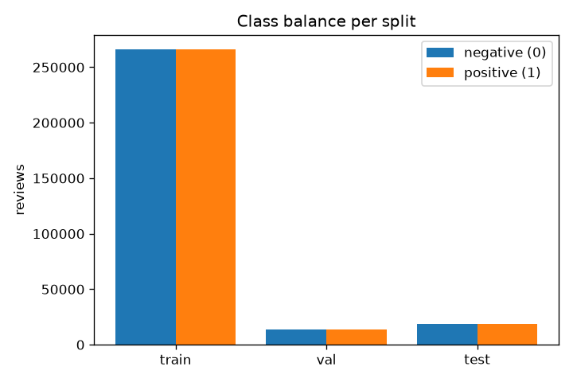
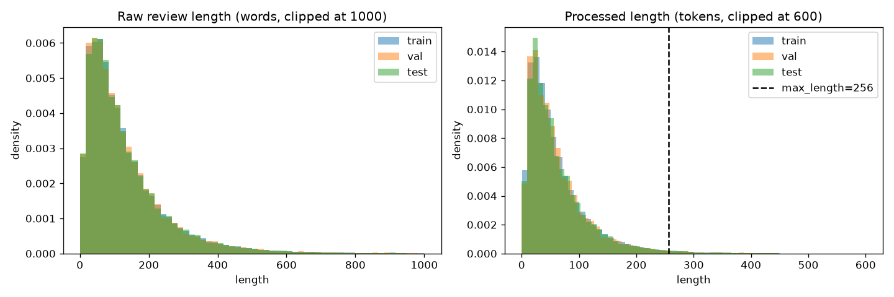

# Task 2: Yelp Polarity Sentiment Classification (Parth)

Every number here is copied from a run artifact, and each table names its source file. Values are rounded to 4 decimals; full precision is in `metrics_report.csv`.

| Artifact | Path (under `task2_sentiment/parth/`) |
|---|---|
| Final notebook | `src/task2.ipynb` |
| Config | `config/train.yaml` |
| Metrics (one row per model) | `metrics_report.csv`; per-model detail in `outputs/metrics_<model>.json` |
| McNemar tests | `outputs/mcnemar_results.csv` |
| Slice metrics | `outputs/slice_metrics_<model>.csv` |
| EDA | `outputs/eda_summary.json`, `figures/eda_review_length_distribution.png`, `figures/eda_class_balance.png` |
| Training history / summaries | `outputs/history_<model>.json`, `outputs/train_summary_<model>.json` |
| Figures | `figures/loss_curve_<model>.png` (neural models), `figures/confusion_matrix_<model>.png`, `figures/reliability_<model>.png` |
| Raw logs and manifests | `logs/train_<model>_*.log`, `logs/eval_<model>_*.log`, `logs/manifest_*.json` (byte-identical copies in `reproducibility/raw_logs/task2_parth/` and `reproducibility/manifests/task2_parth/`) |
| Error analysis | `failure_analysis.md`, `outputs/error_review_candidates_<model>.csv` |

## 1. Data and preprocessing

Source: `outputs/eda_summary.json`, `src/dataset.py`, `src/tokenizer.py`, `config/train.yaml`, `logs/train_logreg_20260925_231345.log`.

### Dataset and cleaning

| Item | Value |
|---|---|
| Source | Hugging Face `fancyzhx/yelp_polarity` (official train / test split) |
| Raw rows | 560,000 train, 38,000 test |
| Missing text / invalid labels / empty text | 0 / 0 / 0 in both splits |
| Duplicate texts / conflicting-label texts (train) | 0 / 0 |
| Train reviews dropped for being empty after preprocessing | 35 |
| Exact train/test text overlap | 0 |
| Label mapping | 0 = negative, 1 = positive |
| Validation split | 5% of the official train set, stratified by label, seed 8503 |
| Final split sizes | train 531,965 / val 28,000 / test 38,000 |

Reviews that are empty after preprocessing are dropped from train only; 2 validation and 1 test review are empty after preprocessing and are kept (the tokenizer encodes an empty review as a single `<unk>`).

### Class balance

| Split | Negative (0) | Positive (1) | Positive fraction |
|---|---|---|---|
| train | 265,978 | 265,987 | 0.5000 |
| val | 14,000 | 14,000 | 0.5000 |
| test | 19,000 | 19,000 | 0.5000 |

Train is balanced to within 9 reviews (265,978 negative, 265,987 positive), and validation and test are exactly 50/50. With balanced classes, accuracy is not inflated by a majority class (always predicting one class scores 0.50), so it is a fair headline metric. For a single-label binary task, micro-averaged precision, recall and F1 all equal accuracy by definition, which is why those rows match; macro-F1, MCC, ROC-AUC, Brier score and ECE are still reported because they describe per-class balance, correlation, ranking and probability quality, which accuracy alone does not.

### Review length

| Split | Mean raw words | Median | p90 | p99 | Max | Median processed tokens | p99 processed tokens | Fraction truncated at 256 tokens |
|---|---|---|---|---|---|---|---|---|
| train | 134.2 | 98 | 284 | 614 | 1,052 | 46 | 285 | 0.0145 |
| val | 132.5 | 97.5 | 279 | 600 | 1,003 | 46 | 280 | 0.0136 |
| test | 133.6 | 98 | 283 | 607 | 1,007 | 46 | 280 | 0.0142 |

Review length has a long right tail: test reviews have a mean of 133.6 raw words, a median of 98 and a 99th percentile of 607 (maximum 1,007). Preprocessing removes stopwords and punctuation, so the median review has 46 processed tokens and the 99th percentile 280. With `max_length` 256, 1.42% of test reviews (1.45% of train) are truncated to their first 256 tokens.

A limit of 256 tokens keeps about 98.6% of reviews whole while capping the cost of padded batches on the long tail; it is a coverage and compute trade-off, not an experimentally tuned value. The logistic regression uses every token, so truncation only affects the neural models. On the 540 truncated test reviews the TextCNN error rate is 8.89% against 6.17% on the rest (MeanPoolMLP 7.59% against 6.86%, logistic regression 5.19% against 5.37%, counted from `outputs/predictions_<model>.csv`); with only 540 reviews this is a hint that truncation costs the neural models something, not a measured effect.

### Preprocessing pipeline (as implemented)

| Step | Implementation |
|---|---|
| CSV artifacts | Literal `\n` replaced with a space, `\"` replaced with `"` |
| Lowercasing | `str.lower()` |
| Punctuation / special characters | Apostrophes removed without splitting (`don't` -> `dont`); every other non-alphanumeric character replaced with a space |
| Stopwords | scikit-learn `ENGLISH_STOP_WORDS` minus a protected list: not, no, nor, never, nothing, none, cannot, neither, nobody, noone, nowhere |
| Stemming | NLTK `PorterStemmer` (no lemmatization) |
| Tokenization | Whitespace split of the cleaned text |
| Neural vocabulary | Built from the training split only; top 50,000 entries including `<pad>` (id 0) and `<unk>` (id 1), `min_freq` 2 |
| Neural sequence length | First 256 tokens kept; batches padded to the longest review in the batch with a padding mask |
| Baseline features | TF-IDF on the same preprocessed token string |

### Why each step

- **Lowercasing and punctuation removal** merge surface variants ("Great", "GREAT!!!") into one token, which keeps the 50,000-word vocabulary and the 200,000 TF-IDF features focused on words rather than spellings. The cost is that the emphasis carried by capitals and exclamation marks is lost.
- **Protected negations.** scikit-learn's stopword list contains not, no, nor, never, nothing, none, cannot, neither, nobody, noone and nowhere. Removing them would turn "not good" into "good" and "never again" into "again", reversing the meaning, so the config keeps them.
- **Stemming** (Porter) maps "loved", "loving" and "loves" to "love", which shrinks the vocabulary and pools the evidence for rare word forms. The cost is lost distinctions and non-words such as "servic"; lemmatization would keep real words but needs part-of-speech tagging to be accurate, while the stemmer is a fast rule-based pass over 560,000 reviews.
- **Apostrophes** are deleted without splitting, so "don't" becomes "dont" and "didn't" becomes "didnt". These forms are not on the stopword list and survive as single tokens, but the models see "didnt" and "did not" as different words.
- **Side effects of the stock stopword list** (checked against scikit-learn 1.9.1, the version recorded in the run manifests). Besides the protected negations, the list removes the contrast words "but", "however", "although", "though", "yet" and "except", limiters and intensifiers such as "only", "very", "too", "much", "more", "less" and "enough", and number words such as "one", "two" and "five". For example, "I gave it two stars, but it's because of my tastes" becomes `gave star tast` (case 19 in `failure_analysis.md`). No run measured the effect, but it means the models never see most of the words that define the `has_contrast` slice; only "unfortunately" survives.

## 2. Models

Source: `config/train.yaml`, `src/models.py`, model printouts and parameter counts in the training logs.

| Model | Role | Architecture | Embeddings | Key hyperparameters | Parameters |
|---|---|---|---|---|---|
| `logreg` | Baseline | TF-IDF (1-2 grams, 200,000 features, `min_df` 3, sublinear tf) -> logistic regression (C = 1.0, lbfgs, `max_iter` 1000) | None; sparse TF-IDF fitted on the training split only | Converged in 26 iterations | 200,001 |
| `neural` | Experimental 1 | Embedding(50,000, 128, padding 0) -> masked mean pool -> Dropout(0.2) -> Linear(128, 256) -> ReLU -> Dropout(0.2) -> Linear(256, 2) | Learned from scratch, random init | AdamW lr 3e-4, weight decay 0.01, batch 128, 5 epochs, grad clip 1.0, best checkpoint by val loss | 6,433,538 |
| `neural_cnn` | Experimental 2 | Embedding(50,000, 128, padding 0) -> Conv1D x3 (kernel 3/4/5, 128 filters each) -> ReLU -> masked global max pool -> concat (384) -> Dropout(0.3) -> Linear(384, 2) | Learned from scratch, random init | Same optimizer settings as `neural`; dropout 0.3 | 6,597,762 |

No pretrained embeddings, tokenizers, or language models are used anywhere in `src/`.

Differences between models (from the config):

- `neural` vs `logreg`: dense embeddings learned end to end and a neural classifier, instead of sparse TF-IDF n-gram features with a linear model.
- `neural_cnn` vs `neural`: mean pooling + MLP replaced by convolutions over 3-, 4-, and 5-token windows with max pooling; dropout 0.3 instead of 0.2. Embedding size, vocabulary, optimizer, learning rate, batch size, and epochs are identical.

### Model justification

#### Baseline: TF-IDF + logistic regression

TF-IDF with logistic regression is a strong, standard baseline for sentiment classification. Unigrams carry most sentiment cues ("delicious", "rude"), bigrams add short patterns that single words miss, including negation pairs that survive preprocessing such as "not worth" or "never return", and sublinear TF-IDF down-weights terms that are frequent everywhere while keeping discriminative ones. A linear model over 200,000 sparse features with `min_df` 3 is well matched to 532K training reviews and fits in 58 s on the CPU.

It is also the best model here on every predictive metric (accuracy 0.9463, ROC-AUC 0.9876, MCC 0.8927, Brier 0.0424), so it is a demanding reference rather than a weak one. The lab's requirement to learn textual embeddings from scratch is met by the two neural models; the baseline uses no embeddings, only TF-IDF features fitted on the training split.

#### Experimental 1: MeanPoolMLP

The MeanPoolMLP is the simplest neural model that learns embeddings from scratch. Each of the 50,000 vocabulary entries gets a 128-dimensional vector learned during training (6.4M of its 6,433,538 parameters), a masked mean over the non-padding positions turns a review of any length into one fixed-size vector, and a two-layer MLP (128 to 256 to 2 units, ReLU, dropout 0.2) learns nonlinear combinations of the averaged features.

The mean ignores order: "good food, terrible service" and "terrible food, good service" get the same representation, so phrases, negation scope and contrast are visible only through which words occur. That is a plausible reason why it trails both other models and has the highest error rate on the `has_contrast` slice (0.0776), but no run isolated it. The sizes (embedding 128, hidden 256, dropout 0.2, vocabulary 50,000, max length 256, 5 epochs) are a moderate configuration that trains in 73 s on the RTX 5090; no other setting was run.

#### Experimental 2: TextCNN

The TextCNN keeps the same from-scratch embeddings but replaces the mean with parallel 1-D convolutions of width 3, 4 and 5 tokens, 128 filters each. Each filter acts as a learned detector for a short phrase pattern, the three widths cover phrases of different lengths, and max-over-time pooling keeps each filter's strongest match wherever it occurs in the review (windows that contain only padding are masked out). The 384 pooled features pass through dropout 0.3 (0.2 in the MeanPoolMLP) and a linear layer.

It beats the MeanPoolMLP on every metric in the table (accuracy 0.9379 against 0.9313, MCC 0.8759 against 0.8626), which fits the idea that local word order helps, although the two models also differ in dropout. It still trails the logistic regression, and each filter sees at most 5 processed tokens, so it cannot link a clause at the start of a review with a verdict at the end.

### Teammate comparison

**TEAMMATE COMPARISON REQUIRED BEFORE FINAL SUBMISSION.** No teammate model or result is in this repository, so no comparison is made here. This is a team-level item, not part of the individual implementation.

## 3. Training

Source: training logs and `outputs/history_<model>.json`. Neural training loss is the mean over the epoch with dropout on; validation loss is in eval mode on 28,000 reviews. Logistic regression is fitted once.

| Epoch | `neural` train loss | `neural` val loss | `neural` val acc | `neural_cnn` train loss | `neural_cnn` val loss | `neural_cnn` val acc |
|---|---|---|---|---|---|---|
| 1 | 0.3035 | 0.2213 | 0.9146 | 0.2892 | 0.2044 | 0.9171 |
| 2 | 0.2196 | 0.2022 | 0.9235 | 0.2047 | 0.1835 | 0.9259 |
| 3 | 0.2012 | 0.1956 | 0.9254 | 0.1787 | 0.1732 | 0.9314 |
| 4 | 0.1909 | 0.1913 | 0.9265 | 0.1632 | 0.1679 | 0.9338 |
| 5 | 0.1842 | 0.1885 | 0.9273 | 0.1514 | 0.1643 | 0.9360 |

Both neural models reached their lowest validation loss at epoch 5, so `best_<model>.pt` is the epoch-5 checkpoint. No non-finite loss or gradient steps occurred (`nan_or_skipped_steps` = 0). Maximum pre-clip gradient norm: 0.4910 (`neural`), 8.9080 (`neural_cnn`, epoch 1).

| Model | Train loss (checkpoint) | Val loss (checkpoint) | Val accuracy | How train loss is measured |
|---|---|---|---|---|
| `logreg` | 0.1385 | 0.1577 | 0.9437 | Log loss on the full training split after fitting |
| `neural` | 0.1842 | 0.1885 | 0.9273 | Epoch-5 running mean, dropout on |
| `neural_cnn` | 0.1514 | 0.1643 | 0.9360 | Epoch-5 running mean, dropout on |

Loss curves: `figures/loss_curve_neural.png`, `figures/loss_curve_neural_cnn.png`.

### Interpretation

Both neural models improve in every epoch and reach their lowest validation loss at the last epoch, so the epoch-5 checkpoints are the reported ones. The validation loss was still falling at epoch 5 (by 0.0028 for the MeanPoolMLP and 0.0036 for the TextCNN between epochs 4 and 5), so more epochs might have helped; that was not tested, and the shrinking improvements suggest any gain would be small.

There is no strong sign of overfitting. The TextCNN's epoch-mean training loss falls below its validation loss from epoch 4 (0.1632 against 0.1679, then 0.1514 against 0.1643), a small and stable gap, while the MeanPoolMLP's two losses stay close (0.1842 against 0.1885 at epoch 5). The training loss is a running mean with dropout on, so it is not directly comparable with the eval-mode validation loss.

Gradient clipping at 1.0 caps the size of each update. The largest pre-clip norm was 0.4910 for the MeanPoolMLP, so clipping never acted there, and 8.9080 for the TextCNN in epoch 1, so clipping limited at least some of its early updates; its effect on the TextCNN's training was not measured. No non-finite loss or gradient steps occurred.

## 4. Results (test set, 38,000 reviews)

Source: `metrics_report.csv`. Threshold 0.5. Bootstrap CIs use 1,000 resamples of the test set (percentile method, seed 8503). ECE uses 15 equal-width confidence bins over [0.5, 1].

| Metric | `logreg` (baseline) | `neural` (exp. 1) | `neural_cnn` (exp. 2) |
|---|---|---|---|
| Accuracy | 0.9463 | 0.9313 | 0.9379 |
| Accuracy 95% CI | [0.9441, 0.9484] | [0.9286, 0.9337] | [0.9354, 0.9401] |
| Precision / Recall / F1 (macro) | 0.9463 / 0.9463 / 0.9463 | 0.9313 / 0.9313 / 0.9313 | 0.9380 / 0.9379 / 0.9379 |
| Precision / Recall / F1 (micro) | 0.9463 / 0.9463 / 0.9463 | 0.9313 / 0.9313 / 0.9313 | 0.9379 / 0.9379 / 0.9379 |
| Precision / Recall / F1 (weighted) | 0.9463 / 0.9463 / 0.9463 | 0.9313 / 0.9313 / 0.9313 | 0.9380 / 0.9379 / 0.9379 |
| Macro-F1 95% CI | [0.9441, 0.9484] | [0.9285, 0.9337] | [0.9354, 0.9401] |
| ROC-AUC | 0.9876 | 0.9803 | 0.9848 |
| PR-AUC | 0.9881 | 0.9804 | 0.9853 |
| MCC | 0.8927 | 0.8626 | 0.8759 |
| MCC 95% CI | [0.8882, 0.8967] | [0.8571, 0.8673] | [0.8708, 0.8803] |
| Brier score | 0.0424 | 0.0517 | 0.0461 |
| ECE (15 bins) | 0.0321 | 0.0048 | 0.0059 |

### Confusion matrices

| Model | TN | FP | FN | TP |
|---|---|---|---|---|
| `logreg` | 17,964 | 1,036 | 1,003 | 17,997 |
| `neural` | 17,705 | 1,295 | 1,315 | 17,685 |
| `neural_cnn` | 17,703 | 1,297 | 1,063 | 17,937 |

Figures: `figures/confusion_matrix_<model>.png`, `figures/reliability_<model>.png`.

### McNemar tests (paired, same 38,000 test reviews, matched on review id)

Source: `outputs/mcnemar_results.csv`. Chi-square with continuity correction, 1 degree of freedom.

| Comparison | Baseline right, model wrong | Baseline wrong, model right | Statistic | p-value |
|---|---|---|---|---|
| `logreg` vs `neural` | 947 | 376 | 245.58 | 2.39e-55 |
| `logreg` vs `neural_cnn` | 834 | 513 | 76.02 | 2.81e-18 |

Reviews where exactly one of the two models is right: `outputs/disagreements_logreg_vs_neural.csv`, `outputs/disagreements_logreg_vs_neural_cnn.csv`.

### Interpretation

- **Best predictive performance: logistic regression.** It has the highest accuracy (0.9463), ROC-AUC (0.9876), PR-AUC (0.9881) and MCC (0.8927) and the lowest Brier score (0.0424).
- **Best neural model: TextCNN.** It is ahead of the MeanPoolMLP on accuracy, ROC-AUC, MCC and Brier score.
- **Best calibration by ECE: MeanPoolMLP** (0.0048), with the TextCNN close behind (0.0059) and the logistic regression highest (0.0321).
- **Bootstrap confidence intervals.** The 95% intervals come from 1,000 resamples of the test set and show how much test accuracy would vary across test sets of this size. The logistic regression interval [0.9441, 0.9484] does not overlap the MeanPoolMLP [0.9286, 0.9337] or TextCNN [0.9354, 0.9401] intervals.
- **McNemar tests.** All models are scored on the same 38,000 reviews, so the paired test uses only the discordant reviews: b counts reviews the baseline gets right and the other model gets wrong, c the reverse. Against the MeanPoolMLP b = 947 and c = 376 (p = 2.39e-55); against the TextCNN b = 834 and c = 513 (p = 2.81e-18). Both p-values give strong evidence that the error patterns differ and that the baseline is wrong less often, but statistical significance is not practical size: the accuracy gap to the TextCNN is 0.84 points.
- **Calibration versus accuracy.** ECE measures whether confidence matches observed accuracy, not whether predictions are right, so the two can disagree. The logistic regression is underconfident: in all 15 confidence bins its accuracy is higher than its average confidence (signed confidence minus accuracy -0.0321); one plausible reason, not tested, is that L2 regularization (C = 1.0) shrinks its weights and pulls probabilities toward 0.5. The neural models were trained with cross-entropy and selected by validation loss, and their confidence tracks accuracy closely (signed gap +0.0012 for the MeanPoolMLP and +0.0032 for the TextCNN, slightly overconfident). A lower ECE does not make a model better overall: the logistic regression still has the lowest Brier score, which reflects both calibration and accuracy.

### Per-slice robustness

Source: `outputs/slice_metrics_<model>.csv`. Slices are computed on the raw review text. Short = at most 50 words, long = at least 300 words. Negation = any of not, no, never, nothing, none, nobody, neither, nor, cannot, without, or an `n't` contraction. Contrast = any of but, however, although, though, except, yet, unfortunately.

| Slice | n | Positive fraction | `logreg` macro-F1 / error | `neural` macro-F1 / error | `neural_cnn` macro-F1 / error |
|---|---|---|---|---|---|
| all | 38,000 | 0.5000 | 0.9463 / 0.0537 | 0.9313 / 0.0687 | 0.9379 / 0.0621 |
| short | 9,287 | 0.5986 | 0.9436 / 0.0541 | 0.9270 / 0.0701 | 0.9298 / 0.0672 |
| medium | 25,377 | 0.4855 | 0.9458 / 0.0541 | 0.9308 / 0.0691 | 0.9389 / 0.0610 |
| long | 3,336 | 0.3360 | 0.9448 / 0.0489 | 0.9304 / 0.0615 | 0.9372 / 0.0561 |
| has negation | 28,544 | 0.4135 | 0.9426 / 0.0557 | 0.9245 / 0.0731 | 0.9335 / 0.0645 |
| no negation | 9,456 | 0.7612 | 0.9334 / 0.0476 | 0.9224 / 0.0554 | 0.9229 / 0.0548 |
| has contrast | 22,770 | 0.4493 | 0.9382 / 0.0612 | 0.9216 / 0.0776 | 0.9306 / 0.0688 |
| no contrast | 15,230 | 0.5758 | 0.9566 / 0.0424 | 0.9433 / 0.0554 | 0.9466 / 0.0521 |

`has contrast` has the highest error rate among slices with at least 100 reviews for all three models.

`has_contrast` has the highest error rate among slices with at least 100 reviews for all three models (0.0612 logistic regression, 0.0776 MeanPoolMLP, 0.0688 TextCNN, against 0.0424, 0.0554 and 0.0521 on `no_contrast`). A review like "good food, but terrible service" contains both polarities, and the label depends on which part the writer weighed more. The contrast words themselves are removed by the stopword list before any model sees the text (section 1), so the models cannot use them to find the decisive clause; that is consistent with the slice result but was not tested.

The negation slice is broad (28,544 of 38,000 reviews, 75%) because it fires on any negation word or n't contraction, so it is closer to "most reviews" than to a hard subset. "No negation" has a lower error rate but also a lower macro-F1 than "has negation" because its classes are unbalanced: 76.1% of no-negation reviews are positive, so errors on the smaller negative class weigh heavily in the macro average. Short reviews are 59.9% positive and long reviews 33.6% positive, so slice error rates mix difficulty with class composition.

### Efficiency

Source: `metrics_report.csv`. Training time covers the fit (logreg) or the epoch loop (neural), not data preparation. CPU RSS is the process-lifetime peak; the logreg training run also downloaded and preprocessed the full dataset, while the neural runs loaded the cached processed data, so CPU RSS is not directly comparable across models.

| Model | Parameters | Training time (s) | Train examples/s | Inference time, 38k reviews (s) | Inference examples/s | Train peak GPU (MB) | Train peak CPU RSS (MB) | Eval peak GPU (MB) | Eval peak CPU RSS (MB) |
|---|---|---|---|---|---|---|---|---|---|
| `logreg` | 200,001 | 58.41 | 9,107 | 1.64 | 23,129 | n/a (CPU) | 7,932.6 | n/a (CPU) | 1,347.3 |
| `neural` | 6,433,538 | 73.12 | 36,376 | 1.17 | 32,475 | 292.3 | 2,651.8 | 186.4 | 1,347.4 |
| `neural_cnn` | 6,597,762 | 127.06 | 20,934 | 1.32 | 28,821 | 486.0 | 2,904.0 | 377.7 | 1,463.3 |

## 5. Hardware

Source: `train_device` / `eval_device` columns of `metrics_report.csv`, the `Hardware:` line of each training log, and `logs/manifest_*.json`.

| Model | Train device | Eval device | Seed |
|---|---|---|---|
| `logreg` | CPU, 24 logical cores, x86_64. Exact model: Not recorded (see the note below this table) | Same CPU | 8503 |
| `neural` | NVIDIA GeForce RTX 5090 (sm_120, 31.84 GB) | NVIDIA GeForce RTX 5090 | 8503 |
| `neural_cnn` | NVIDIA GeForce RTX 5090 (sm_120, 31.84 GB) | NVIDIA GeForce RTX 5090 | 8503 |

The logs record the CPU only as `x86_64, 24 cores` (Python's `platform.processor()` on Linux does not return the model name), so the exact CPU model cannot be recovered from the run artifacts.

Environment (all runs, from the manifests): Linux 6.6.87.2 (WSL2), Python 3.11.13, torch 2.7.1+cu128 (CUDA 12.8), numpy 2.2.6, pandas 3.0.6, scikit-learn 1.9.1, scipy 1.17.1, nltk 3.10.3, PyYAML 6.0.2, matplotlib 3.11.2, joblib 1.6.0, datasets 5.0.1. The manifests record git commit `3e96e78887995965eb03081831a19249ec649100`.

## 6. Checkpoint to result mapping

The SHA-256 identifies the exact file behind each row of `metrics_report.csv`.

| Model | Checkpoint | SHA-256 | Train log | Eval log (reported) |
|---|---|---|---|---|
| `logreg` | `checkpoints/logreg_tfidf.joblib` | `5a9b23959ee0ab73ff175557da2b07f4cf95382c3861eb71563acf3e64fd6a35` | `logs/train_logreg_20260925_231345.log` | `logs/eval_logreg_20260925_232211.log` |
| `neural` | `checkpoints/best_neural.pt` (epoch 5) | `ef7925b92afa3ef0f69cfc5ff1cf0b626a2df258d13339937a9f8247b23ceb99` | `logs/train_neural_20260925_231605.log` | `logs/eval_neural_20260925_232219.log` |
| `neural_cnn` | `checkpoints/best_neural_cnn.pt` (epoch 5) | `7f34ff61f82c63b78d93412792a6b14e22c70f55ffc5f57af0ec650d02f61814` | `logs/train_neural_cnn_20260925_231732.log` | `logs/eval_neural_cnn_20260925_232228.log` |

`latest_neural.pt` and `latest_neural_cnn.pt` are also epoch-5 checkpoints that add the optimizer state; they are used only for resuming.

An earlier evaluation pass (`logs/eval_logreg_20260925_232022.log`, `eval_neural_20260925_232030.log`, `eval_neural_cnn_20260925_232038.log`) logged identical metrics but has no final "Wrote metrics_report.csv" line and no manifest; the reported numbers come from the 23:22 pass listed above.

The first evaluation pass (23:20) logged identical metrics but did not record completion, and the reason for the rerun was not recorded; the 23:22 pass completed and wrote `metrics_report.csv` and the evaluation manifests.

`logreg_tfidf.joblib` (9,592,070 bytes), `best_neural.pt` (26,553,669 bytes) and `best_neural_cnn.pt` (27,212,033 bytes) are the models included in the GitHub repository for grading and the live demo; each is below GitHub's 100 MB per-file limit. The `latest_<model>.pt` files are only needed to resume training and are kept out of the repository.

## 7. Comparative analysis

- **Logistic regression.** The strongest predictor on every accuracy-type metric and the cheapest model (200,001 parameters, 58 s of CPU training), and it reads the whole review without truncation. Its weaknesses are underconfident probabilities (ECE 0.0321) and no view of word order beyond bigrams.
- **MeanPoolMLP.** The best calibrated (ECE 0.0048) and fastest at inference (32,475 reviews/s on the GPU), but the least accurate (0.9313) and the worst on every slice, which fits a representation that ignores word order.
- **TextCNN.** The best neural model (accuracy 0.9379, MCC 0.8759) with good calibration (ECE 0.0059), but 0.84 points behind the baseline, the slowest to train (127 s), and the model with the largest error gap between truncated and untruncated reviews (8.89% against 6.17%).
- **Why the simpler model wins.** With 532K training reviews, sparse unigram and bigram TF-IDF features already capture most polarity cues, and the convex logistic regression fits them to convergence. The neural models must learn 6.4M embedding parameters from scratch in 5 epochs and lose some text to truncation; whether pretrained embeddings or longer training would close the gap was outside this implementation and was not tested.
- **Agreement.** The three models agree on 35,867 of 38,000 reviews (34,512 right, 1,355 wrong); the McNemar results show that the remaining disagreements favor the baseline.

### Limitations

- One seed (8503) and one train/validation split, so run-to-run variation is unknown.
- Neural inputs are cut to the first 256 processed tokens (1.42% of test reviews are truncated).
- Embeddings are learned from scratch, and no pretrained language model is used.
- The stock stopword list also removes contrast words, intensifiers and number words, not only uninformative function words.
- Mean pooling discards word order, and each TextCNN filter sees at most 5 tokens.
- 5 epochs at a constant learning rate (no schedule), while the validation loss was still falling.
- Slices are keyword proxies computed on the raw text, and all results come from the single official test set.

### Future work

Each item is an experiment tied to an observed error or slice result; none has been run.

1. **Keep contrast words and intensifiers.** Retrain all three models with "but", "however", "though", "yet", "except", "only" and "very" removed from the stopword list, and compare error rates on the `has_contrast` slice (cases 4, 10, 16 and 20).
2. **Longer neural inputs.** Retrain the TextCNN with `max_length` 512 and compare its error rate on the 540 test reviews that are truncated at 256 (8.89% now).
3. **Order-aware or sentence-level model.** Add a model that keeps order across the review, for example a BiLSTM or attention pooling over sentence vectors, and compare it with the MeanPoolMLP and TextCNN on `has_contrast` and on reviews with temporal markers such as "now", "used to", "EDIT" or "update" (cases 2 and 6).
4. **Label audit.** Manually audit a random sample of the 1,355 reviews all three models get wrong, flag suspected rating-text mismatches (cases 1, 5 and 7), and report accuracy with and without them.
5. **Probability averaging.** Average the logistic regression and TextCNN probabilities with weights chosen on the validation set, and measure accuracy, ECE and the error rate among reviews with P(positive) between 0.4 and 0.6 (cases 11 to 15).
